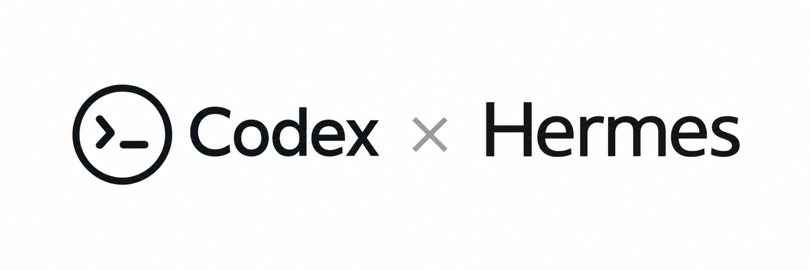
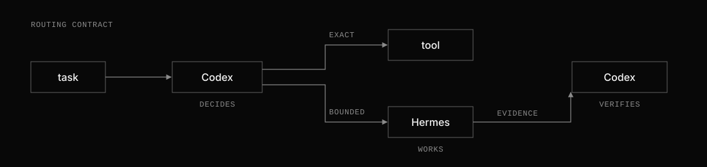

# codex-hermes-router



Let Codex delegate bounded repo work to Hermes, then verify the result.

`codex-hermes-router` is a small delegation layer for Codex users who also run
Hermes. Codex is the router: its skill decides when a subtask is cheap to
verify, `hermes-worker` executes that task with a constrained tool surface, and
Codex treats the result as evidence rather than authority.

## Install

Requirements: a Linux/macOS/WSL-style shell, Python 3, Git, Hermes Agent, and
Codex with user-skill discovery at `$HOME/.agents/skills`.

```bash
git clone https://github.com/Denoax/codex-hermes-router.git
cd codex-hermes-router
./install.sh --dry-run
./install.sh
hermes plugins enable codex-worker-guard
hermes-worker doctor
```

Tested against Hermes Agent 0.21.x. The wrapper checks the required
`hermes chat --oneshot --ignore-rules` and plugin capabilities at runtime
instead of assuming the same behavior across historical releases.

This excerpt was captured from a successful local integration check:

```text
$ hermes-worker doctor
Wrapper: 0.1.0
Python 3: OK
Git: OK
Codex worker skill: OK
Guard enabled: OK
Guard hook: OK
Guard tool override: not granted
Rule isolation: --ignore-rules supported
Doctor: OK
No LLM call was made.
```

The guard does not need Hermes built-in tool override permission. The installer
refuses to overwrite an existing installation; upgrades are currently manual.

## Use it

The intended workflow starts in Codex:

```text
Use $local-worker with the fast tier to map the parser subsystem and relevant tests.
```

The worker can also be called directly:

```bash
printf '%s\n' 'Map the parser subsystem and relevant tests.' \
  | hermes-worker scout --tier fast --repo "$PWD"
```

Prefer stdin or `--task-file` so task text is not interpreted by the shell.
Direct worker execution checks only its runtime safety prerequisites; the Codex
skill is additionally checked by `hermes-worker doctor`.

## Modes

| Mode | Default capability | Purpose |
|---|---|---|
| `scout` | file + terminal, mutation-guarded | repository/source/history mapping |
| `research` | web, mutation-guarded | external evidence |
| `review` | file + terminal, mutation-guarded | first-pass diff/log/test review |
| `prototype` | file + terminal, exact-HEAD worktree, Git reads only | speculative implementation |

All modes have bounded turn counts and write local result, diagnostic, and
metadata files; usage is recorded when Hermes provides it. Provider and model
selection come from the user's Hermes configuration unless explicitly
overridden; this project does not guarantee a local provider.

## Worker tiers

Mode controls tool authority; tier controls worker capability. `--tier inherit`
preserves the existing Hermes provider/model behavior and remains the default for
direct compatibility. Codex should choose `fast` for work that is cheap to verify
or redo, and `strong` when a better first pass materially matters. A weak fast
result may be retried once with strong; the wrapper never runs both automatically.

Fast and strong resolve from the user-local, non-secret
`~/.config/hermes-worker/models.json` file:

```json
{
  "fast": {"provider": "YOUR_FAST_PROVIDER", "model": "YOUR_FAST_MODEL"},
  "strong": {"provider": "YOUR_STRONG_PROVIDER", "model": "YOUR_STRONG_MODEL"}
}
```

Set this file to mode `0600`. Named tiers fail rather than silently falling back
when their entry is missing or invalid. Provider credentials remain under Hermes'
normal credential management and are never stored in tier metadata.

## Optional visual evidence

[`$iris-camera`](skills/iris-camera/SKILL.md) gives Codex a narrow camera for
rendered web/UI evidence. The project installer includes the skill, but the
third-party Iris runtime and MCP registration are optional and separate. Iris
does not affect normal worker execution. It captures pixels; Codex still
performs visual judgment and final approval.

## How it works

1. [`skills/local-worker`](skills/local-worker/SKILL.md) tells Codex which
   bounded, low-risk, easily verified work is suitable for delegation.
2. [`bin/hermes-worker`](bin/hermes-worker) prepares a one-shot Hermes run and
   records its output for inspection.
3. [`codex-worker-guard`](integrations/hermes/codex-worker-guard/__init__.py)
   blocks direct file-write tools and common mutation or remote-action commands.
4. [`iris-camera`](skills/iris-camera/SKILL.md) optionally captures rendered
   evidence after web/UI work.



Prototype mode requires a clean Git worktree. The wrapper resolves the exact
local `HEAD`, creates its own detached worktree at that commit, and runs Hermes
there. Hermes may edit candidate files, but Codex owns Git state and integration.
The wrapper retains dirty candidates and, as a defensive recovery path,
committed candidates; it removes a worktree only when its `HEAD` and file state
both match the base. The wrapper never changes global Hermes worktree
configuration.

## Safety and limitations

The guard is defense-in-depth for trusted development tasks, not an OS sandbox.
Its command-pattern checks reduce accidental side effects but cannot prevent
every indirect or adversarial write. In every mode, remote push, merge, release,
publish, deployment, and known destructive operations are outside worker
authority. Material Hermes output remains evidence or a candidate for Codex to
verify.

Before each run, the wrapper verifies that the guard is enabled, its hook passes
Hermes runtime validation, and no unnecessary tool-override capability is
granted. If activation cannot be verified, Hermes is not invoked. Delegated
sessions use Hermes `--ignore-rules` to avoid implicit personal rules, memory,
and preloaded skills; prototype instructions must be read deliberately from the
workspace.

Runs are stored under
`${XDG_STATE_HOME:-$HOME/.local/state}/hermes-worker/` and can contain task text,
repository paths, results, and diagnostics. Retention is currently manual. Do
not delegate credentials, private data, production mutations, or final
security-sensitive judgment. `hermes-worker stats` includes failed and
incomplete runs even when Hermes produced no usage file. See
[SECURITY.md](SECURITY.md).

## Development

Deterministic validation does not invoke a model:

```bash
bash -n bin/hermes-worker install.sh uninstall.sh
shellcheck bin/hermes-worker install.sh uninstall.sh
python -m unittest discover -s tests -v
```

CI runs the same checks. See [design](docs/design.md) for the delegation policy
and prior art, and [evaluation](docs/evaluation.md) for the validation record and
unexecuted benchmark plan. No token, cost, or quality savings are claimed.

## License

MIT. This independent integration project is not affiliated with, endorsed by,
or maintained by OpenAI or Nous Research. It does not redistribute Codex or
Hermes Agent.
